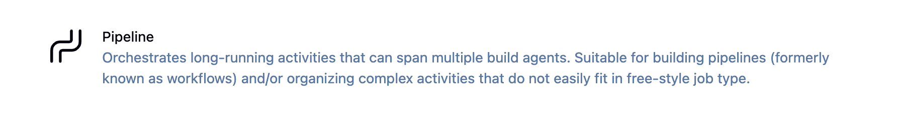

# Jenkins Pipeline

Jenkins Pipeline is a suite of plugins that supports implementing and integrating continuous delivery pipelines into Jenkins. Pipeline provides an extensible set of tools for modeling delivery pipelines "as code".

## What is Jenkins Pipeline?

Pipeline allows you to:
- Define your build process as code (Jenkinsfile)
- Version control your CI/CD pipeline
- Review and iterate on your pipeline
- Implement complex workflows with stages, parallel execution, and conditionals

<div align="center">
  
</div>

## Declarative vs Scripted Pipeline

Jenkins supports two types of Pipeline syntax:

### Declarative Pipeline (Recommended)
- **Newer syntax** introduced in Pipeline 2.5
- **More structured** and opinionated
- **Easier to read** and write
- **Better error checking** and validation
- **Richer syntax** for common patterns

### Scripted Pipeline
- **Original syntax** using Groovy
- **More flexible** but complex
- **Requires Groovy knowledge**
- **Less structure** means more room for errors
- **Still supported** for backward compatibility

### Quick Comparison

| Feature | Declarative | Scripted |
|---------|------------|----------|
| Syntax | Structured blocks | Groovy code |
| Learning Curve | Easier | Steeper |
| Error Validation | At start | At runtime |
| Flexibility | Opinionated | Very flexible |
| Blue Ocean Support | Full | Limited |

## Declarative Pipeline Structure

```groovy
pipeline {
    agent any  // Where to run
    
    environment {  // Environment variables
        // Define variables here
    }
    
    parameters {  // Build parameters
        // Define parameters
    }
    
    triggers {  // Build triggers
        // Define when to run
    }
    
    stages {  // Pipeline stages
        stage('Stage Name') {
            steps {
                // What to do
            }
        }
    }
    
    post {  // Post-build actions
        always {
            // Always run
        }
        success {
            // On success
        }
        failure {
            // On failure
        }
    }
}
```

## Basic Pipeline Example

```groovy
pipeline {
    agent any
    
    stages {
        stage('Checkout') {
            steps {
                echo 'Checking out source code...'
                checkout scm
            }
        }
        
        stage('Build') {
            steps {
                echo 'Building application...'
                sh 'mvn clean compile'
            }
        }
        
        stage('Test') {
            steps {
                echo 'Running tests...'
                sh 'mvn test'
            }
        }
        
        stage('Package') {
            steps {
                echo 'Creating package...'
                sh 'mvn package'
            }
        }
        
        stage('Deploy') {
            steps {
                echo 'Deploying application...'
                sh './deploy.sh'
            }
        }
    }
    
    post {
        always {
            echo 'Pipeline completed!'
            cleanWs()  // Clean workspace
        }
        success {
            echo 'Pipeline succeeded!'
        }
        failure {
            echo 'Pipeline failed!'
            emailext body: 'Build failed', subject: 'Build Failure', to: 'team@example.com'
        }
    }
}
```

## Agent Directive

The `agent` directive specifies where the pipeline or stage should run.

```groovy
// Run on any available agent
agent any

// Run on agent with specific label
agent {
    label 'linux && docker'
}

// Run in Docker container
agent {
    docker {
        image 'maven:3.8.1-openjdk-11'
        args '-v /tmp:/tmp'
    }
}

// Run on Kubernetes
agent {
    kubernetes {
        yaml '''
            apiVersion: v1
            kind: Pod
            spec:
              containers:
              - name: maven
                image: maven:3.8.1
                command: ['cat']
                tty: true
        '''
    }
}

// No global agent (define per stage)
agent none
```

## Environment Variables

```groovy
pipeline {
    agent any
    
    environment {
        // Static values
        APP_NAME = 'my-app'
        APP_VERSION = '1.0.0'
        
        // Dynamic values
        BUILD_TAG = "${env.BUILD_NUMBER}-${env.GIT_COMMIT}"
        
        // Credentials
        DOCKER_CREDS = credentials('docker-hub-credentials')
        
        // Using shell commands
        CURRENT_DATE = sh(script: 'date +%Y%m%d', returnStdout: true).trim()
    }
    
    stages {
        stage('Print Environment') {
            steps {
                echo "App: ${APP_NAME} v${APP_VERSION}"
                echo "Build: ${BUILD_TAG}"
                echo "Date: ${CURRENT_DATE}"
                
                // Credentials are automatically masked
                sh 'docker login -u $DOCKER_CREDS_USR -p $DOCKER_CREDS_PSW'
            }
        }
    }
}
```


## Parameters in Pipeline

```groovy
pipeline {
    agent any
    
    parameters {
        string(name: 'BRANCH', defaultValue: 'main', description: 'Git branch to build')
        choice(name: 'ENVIRONMENT', choices: ['dev', 'qa', 'prod'], description: 'Deployment environment')
        booleanParam(name: 'RUN_TESTS', defaultValue: true, description: 'Run test suite?')
    }
    
    stages {
        stage('Checkout') {
            steps {
                git branch: "${params.BRANCH}", url: 'https://github.com/example/repo.git'
            }
        }
        
        stage('Test') {
            when {
                expression { params.RUN_TESTS == true }
            }
            steps {
                sh 'npm test'
            }
        }
        
        stage('Deploy') {
            steps {
                echo "Deploying to ${params.ENVIRONMENT}"
                sh "./deploy.sh ${params.ENVIRONMENT}"
            }
        }
    }
}
```

## Conditional Execution with 'when'

```groovy
pipeline {
    agent any
    
    stages {
        stage('Deploy to Production') {
            when {
                branch 'main'
                environment name: 'DEPLOY_TO', value: 'production'
                expression { params.DEPLOY == true }
            }
            steps {
                echo 'Deploying to production...'
            }
        }
        
        stage('Run Integration Tests') {
            when {
                anyOf {
                    branch 'main'
                    branch 'develop'
                    changeRequest()  // Is a PR
                }
            }
            steps {
                sh 'npm run test:integration'
            }
        }
        
        stage('Publish Artifacts') {
            when {
                not {
                    changeRequest()
                }
                tag pattern: "v\\d+\\.\\d+\\.\\d+", comparator: "REGEXP"
            }
            steps {
                echo 'Publishing artifacts...'
            }
        }
    }
}
```

## Parallel Execution

```groovy
pipeline {
    agent any
    
    stages {
        stage('Parallel Tests') {
            parallel {
                stage('Unit Tests') {
                    steps {
                        echo 'Running unit tests...'
                        sh 'npm run test:unit'
                    }
                }
                
                stage('Integration Tests') {
                    steps {
                        echo 'Running integration tests...'
                        sh 'npm run test:integration'
                    }
                }
                
                stage('Lint') {
                    steps {
                        echo 'Running linter...'
                        sh 'npm run lint'
                    }
                }
            }
        }
        
        stage('Browser Tests') {
            parallel {
                stage('Chrome') {
                    agent {
                        label 'chrome'
                    }
                    steps {
                        sh 'npm run test:chrome'
                    }
                }
                
                stage('Firefox') {
                    agent {
                        label 'firefox'
                    }
                    steps {
                        sh 'npm run test:firefox'
                    }
                }
            }
        }
    }
}
```

## Error Handling

```groovy
pipeline {
    agent any
    
    stages {
        stage('Build') {
            steps {
                script {
                    try {
                        sh 'make build'
                    } catch (Exception e) {
                        echo "Build failed: ${e.message}"
                        currentBuild.result = 'UNSTABLE'
                    }
                }
            }
        }
        
        stage('Test') {
            steps {
                catchError(buildResult: 'SUCCESS', stageResult: 'FAILURE') {
                    sh 'make test'
                }
            }
        }
        
        stage('Deploy') {
            steps {
                timeout(time: 5, unit: 'MINUTES') {
                    retry(3) {
                        sh 'make deploy'
                    }
                }
            }
        }
    }
}
```

## Creating Your First Pipeline

1. **Create a Jenkinsfile** in your repository root:
```groovy
pipeline {
    agent any
    
    stages {
        stage('Hello') {
            steps {
                echo 'Hello, Jenkins Pipeline!'
            }
        }
    }
}
```

2. **Create Pipeline Job** in Jenkins:
   - New Item → Pipeline
   - Configure → Pipeline → Definition: "Pipeline script from SCM"
   - Set repository URL and credentials
   - Set script path: "Jenkinsfile"

3. **Run and iterate**:
   - Save and build
   - Check Blue Ocean for visualization
   - Refine based on results

## Summary

Jenkins Pipeline as Code brings:
- **Version Control**: Track pipeline changes
- **Reusability**: Share common patterns
- **Visibility**: Clear view of build process
- **Reliability**: Consistent execution

Start with declarative syntax, use the visual Pipeline Syntax generator in Jenkins, and gradually build more complex pipelines as your needs grow. Remember: a good pipeline is one that's easy to understand and maintain. 