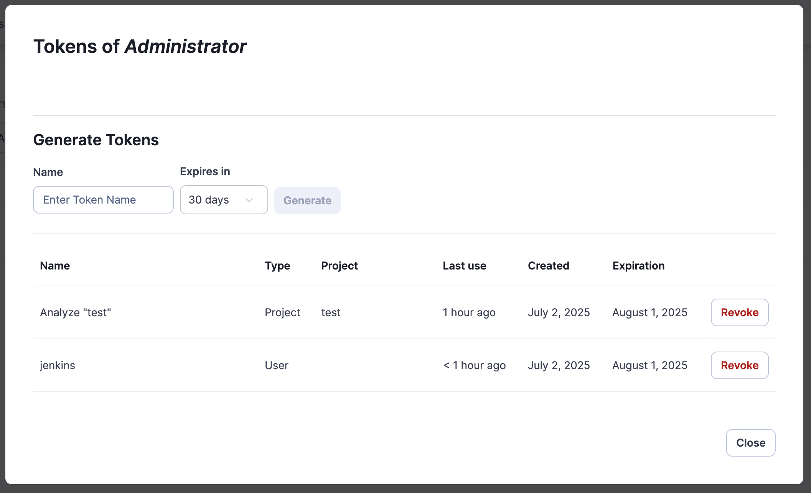
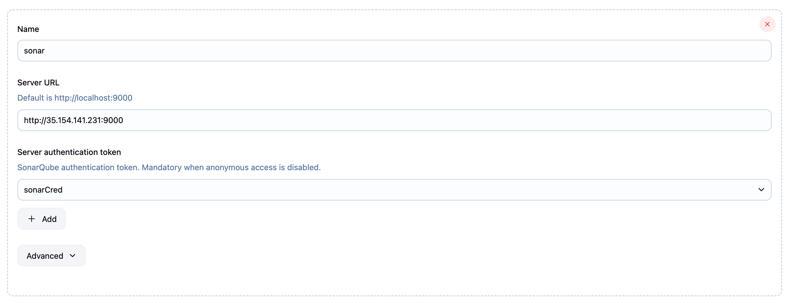
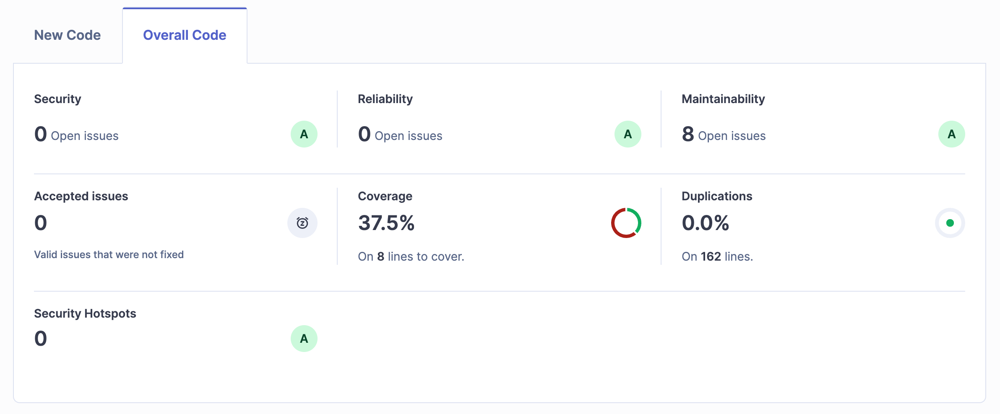

# SonarQube Integration with Jenkins

SonarQube is a powerful static code analysis platform that helps developers maintain code quality by detecting bugs, vulnerabilities, and code smells. Integrating SonarQube with Jenkins enables automated code quality checks in your CI/CD pipeline.

## What is SonarQube?

SonarQube is an open-source platform for continuous inspection of code quality. It performs automatic reviews with static analysis of code to detect:

- **Bugs** - Code issues that could cause runtime errors
- **Vulnerabilities** - Security-related issues
- **Code Smells** - Maintainability issues and bad practices
- **Coverage** - Test coverage analysis
- **Duplications** - Duplicate code blocks

### Key Benefits
- **Early Detection** - Find issues before they reach production
- **Quality Standards** - Enforce coding standards across teams
- **Technical Debt** - Track and manage technical debt
- **Security** - Identify security vulnerabilities
- **Compliance** - Meet regulatory requirements

## SonarQube Concepts

### Rules
Rules define what SonarQube looks for in your code. Each rule has:
- **Severity** - Blocker, Critical, Major, Minor, Info
- **Type** - Bug, Vulnerability, Code Smell
- **Language** - Java, JavaScript, Python, C#, etc.

### Quality Gates
Quality Gates are sets of conditions that determine if your project meets quality standards.

<div align="center">
  
</div>

#### Default Quality Gate Conditions
- **Coverage** - New code coverage ≥ 80%
- **Duplicated Lines** - New duplicated lines ≤ 3%
- **Maintainability Rating** - New maintainability rating = A
- **Reliability Rating** - New reliability rating = A
- **Security Rating** - New security rating = A

### Quality Profiles
Quality Profiles are collections of rules for specific languages. You can:
- Use built-in profiles (Sonar way)
- Create custom profiles
- Extend existing profiles
- Assign profiles to projects

## Setting Up SonarQube Integration

### Prerequisites
1. SonarQube server running and accessible
2. SonarQube Scanner plugin installed in Jenkins

### Step 1: Generate SonarQube Token

Navigate to SonarQube and create an authentication token:

<div align="center">
  
</div>

1. **Login to SonarQube**
2. **Go to My Account** → Security
3. **Generate Token** with appropriate name
4. **Copy the token** (you won't see it again)

### Step 2: Configure SonarQube Server in Jenkins

<div align="center">
  
</div>

1. **Navigate to Jenkins Configuration**
   ```
   Manage Jenkins → Configure System → SonarQube servers
   ```

2. **Add SonarQube Server**
   - **Name**: `sonar` (referenced in pipeline)
   - **Server URL**: `http://sonarqube-server:9000`
   - **Server authentication token**: Add the token as Secret Text credential

### Step 3: Configure SonarQube Scanner

1. **Global Tool Configuration**
   ```
   Manage Jenkins → Global Tool Configuration → SonarQube Scanner
   ```

2. **Add SonarQube Scanner [optional]**
   - **Name**: `SonarQubeScanner`
   - **Install automatically**: Check if desired
   - **Version**: Select appropriate version

## SonarQube Analysis in Pipeline

### Basic Pipeline Integration

```groovy
pipeline {
    agent any
    
    tools {
        maven 'Maven-3.8'
    }
    
    stages {
        stage('Checkout') {
            steps {
                checkout scm
            }
        }
        
        stage('Build') {
            steps {
                sh 'mvn clean compile'
            }
        }
        
        stage('Test') {
            steps {
                sh 'mvn test'
            }
        }
        
        stage('Sonar Analysis') {
            steps {
                dir('javaapp-pipeline') {
                    withSonarQubeEnv('sonar') {
                        sh '''
                            mvn verify sonar:sonar \
                            -Dsonar.projectKey=java-app \
                            -Dsonar.projectName=java-app 
                        '''
                    }
                }
            }
        }
    }
}
```

## SonarQube Analysis Results

<div align="center">
  
</div>

### Understanding the Dashboard
- **Overall Code** - Total lines of code analyzed
- **New Code** - Code added/modified since last version
- **Issues** - Bugs, vulnerabilities, and code smells
- **Coverage** - Test coverage percentage
- **Duplications** - Percentage of duplicated code

## Language-Specific Configurations

### Java Projects

```groovy
stage('Sonar Analysis') {
    steps {
        withSonarQubeEnv('sonar') {
            sh '''
                mvn clean verify sonar:sonar \
                -Dsonar.projectKey=java-app \
                -Dsonar.projectName=java-app \
                -Dsonar.java.source=11 \
                -Dsonar.java.target=11 \
                -Dsonar.coverage.jacoco.xmlReportPaths=target/site/jacoco/jacoco.xml \
                -Dsonar.junit.reportPaths=target/surefire-reports
            '''
        }
    }
}
```

### JavaScript/Node.js Projects

```groovy
stage('Sonar Analysis') {
    steps {
        withSonarQubeEnv('sonar') {
            sh '''
                sonar-scanner \
                -Dsonar.projectKey=node-app \
                -Dsonar.projectName=node-app \
                -Dsonar.sources=src \
                -Dsonar.tests=test \
                -Dsonar.javascript.lcov.reportPaths=coverage/lcov.info \
                -Dsonar.testExecutionReportPaths=test-results/test-reporter.xml
            '''
        }
    }
}
```

### Python Projects

```groovy
stage('Sonar Analysis') {
    steps {
        withSonarQubeEnv('sonar') {
            sh '''
                sonar-scanner \
                -Dsonar.projectKey=python-app \
                -Dsonar.projectName=python-app \
                -Dsonar.sources=src \
                -Dsonar.tests=tests \
                -Dsonar.python.coverage.reportPaths=coverage.xml \
                -Dsonar.python.xunit.reportPath=test-results.xml
            '''
        }
    }
}
```

### .NET Projects

```groovy
stage('Sonar Analysis') {
    steps {
        withSonarQubeEnv('sonar') {
            sh '''
                dotnet sonarscanner begin \
                /k:"dotnet-app" \
                /n:"dotnet-app" \
                /d:sonar.cs.opencover.reportsPaths="**/coverage.opencover.xml"
                
                dotnet build
                dotnet test --collect:"XPlat Code Coverage" -- DataCollectionRunSettings.DataCollectors.DataCollector.Configuration.Format=opencover
                
                dotnet sonarscanner end
            '''
        }
    }
}
```

## Summary

SonarQube integration with Jenkins provides:
- **Automated Quality Checks** - Every build gets analyzed
- **Quality Gates** - Prevent poor quality code from advancing
- **Trend Analysis** - Track quality metrics over time
- **Developer Feedback** - Early detection of issues
- **Compliance** - Meet regulatory requirements

Start with basic integration, gradually implement quality gates, and customize rules based on your team's needs. Regular analysis helps maintain high code quality and reduces technical debt over time.