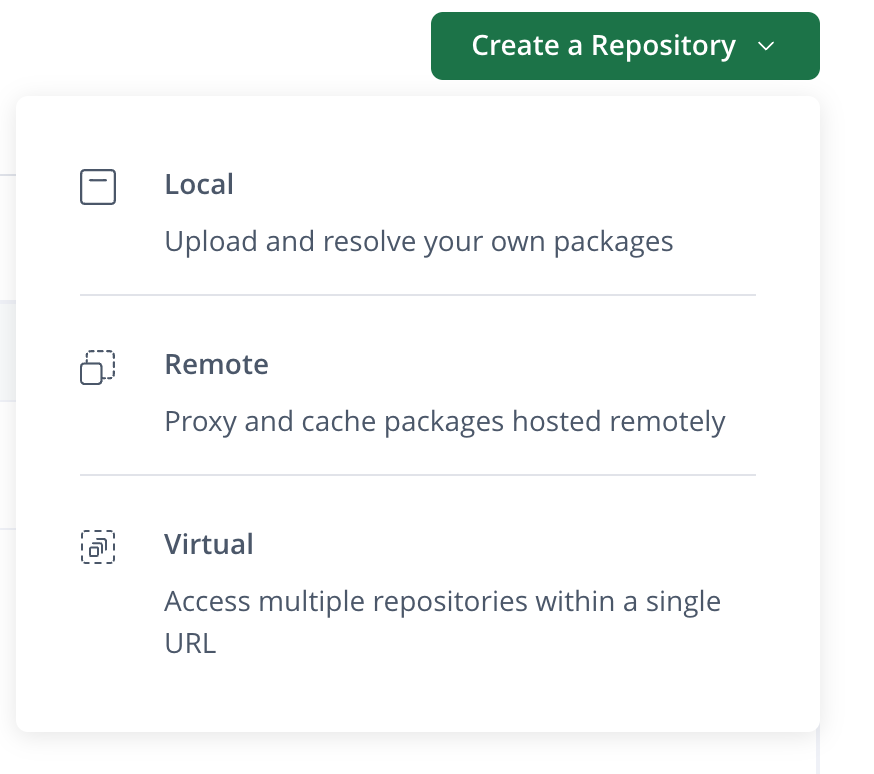
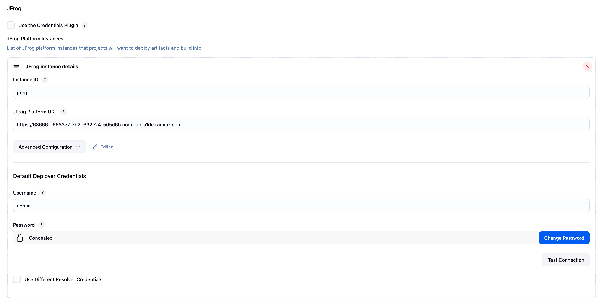

# JFrog Artifactory Integration with Jenkins

JFrog Artifactory is a universal artifact repository manager that supports all major package formats and integrates seamlessly with Jenkins for automated build and deployment workflows.

## What is JFrog Artifactory?

JFrog Artifactory is a repository manager that serves as a central hub for storing, managing, and distributing software artifacts. It acts as a proxy, cache, and hosting repository for various package types.

### Key Benefits
- **Universal Support** - Supports 30+ package types (Maven, npm, Docker, PyPI, etc.)
- **High Availability** - Enterprise-grade reliability and performance
- **Security** - Fine-grained access controls and vulnerability scanning
- **Build Integration** - Deep integration with CI/CD tools like Jenkins
- **Metadata Management** - Rich metadata and search capabilities

## Installing JFrog Artifactory with Docker Compose

### Prerequisites
- Docker and Docker Compose installed
- Minimum 4GB RAM available
- 50GB+ disk space for artifacts

### Step 1: Download JFrog Artifactory OSS

1. **Download the Docker Compose package**
   ```bash
   wget https://releases.jfrog.io/artifactory/bintray-artifactory/org/artifactory/oss/docker/jfrog-artifactory-oss/[RELEASE]/jfrog-artifactory-oss-[RELEASE]-compose.tar.gz
   ```

2. **Extract the package**
   ```bash
   # Replace [RELEASE] with the latest version (e.g., 7.111.11)
   tar -xzf jfrog-artifactory-oss-[RELEASE]-compose.tar.gz
   cd artifactory-oss-[RELEASE]
   ```

### Step 2: Run Installation Script

1. **Execute the configuration script**
   ```bash
   sudo ./config.sh
   ```

2. **Follow the installation prompts**
   ```
   Are you adding an additional node to an existing product cluster? [y/N]: n
   
   The installer can install a PostgreSQL database, or you can connect to an existing compatible PostgreSQL database
   (https://jfrog.com/help/r/jfrog-installation-setup-documentation/requirements-matrix)
   If you are upgrading from an existing installation, select N if you have externalized PostgreSQL, select Y if not.
   Do you want to install PostgreSQL? [Y/n]: y
   ```

   > **Note**: Selecting 'y' for PostgreSQL will install and configure a PostgreSQL database container

### Step 3: Start Artifactory

1. **Start the services using Docker Compose**
   ```bash
   docker-compose -p rt up -d
   ```

2. **Access Artifactory**
   - Open your browser and navigate to `http://<ip>:8082`
   - Default credentials: `admin/password`
   - Change the default password on first login

### Step 4: Verify Installation

```bash
# Check running containers
docker ps
```

## Artifactory Concepts

### Repository Types

<div align="center">
  
</div>

#### Local Repositories
Store artifacts built by your organization or uploaded manually.

#### Remote Repositories
Proxy and cache external repositories (Maven Central, npm registry, etc.)

#### Virtual Repositories
Aggregate multiple repositories under a single URL

### Common Repository Examples

When setting up Artifactory, these repositories are typically created automatically or commonly configured:

#### Maven Repositories
- **libs-release-local** - Release versions of internal libraries
- **libs-snapshot-local** - Snapshot/development versions
- **libs-release** - Virtual repository combining local and remote releases
- **repo1-cache** - Cache for Maven Central repository

#### Docker Repositories  
- **docker-local** - Internal Docker images
- **docker-remote** - Proxy for Docker Hub
- **docker** - Virtual repository for all Docker images

#### npm Repositories
- **npm-local** - Internal npm packages
- **npm-remote** - Proxy for npm registry
- **npm** - Virtual repository for npm packages

#### Generic Repositories
- **generic-local** - Generic artifacts (ZIP, TAR, etc.)
- **releases** - Release artifacts
- **snapshots** - Development artifacts

## Setting Up JFrog Integration

### Prerequisites
1. JFrog Artifactory instance running and accessible
2. JFrog Artifactory plugin installed in Jenkins
3. Valid Artifactory credentials

### Step 1: Install JFrog Artifactory Plugin

1. **Navigate to Plugin Manager**
   ```
   Manage Jenkins → Manage Plugins → Available
   ```

2. **Search and Install**
   - Search for "Artifactory"
   - Install "Artifactory" plugin
   - Restart Jenkins if required

### Step 2: Configure Artifactory Server

<div align="center">
  
</div>

1. **Navigate to System Configuration**
   ```
   Manage Jenkins → Configure System → JFrog
   ```

2. **Add Artifactory Server**
   - **Server ID**: `jfrog` (used in pipeline)
   - **URL**: `http://localhost:8082/artifactory` (or your Artifactory URL)
   - **Default Deployer Credentials**: Add username/password or API key
   - **Test Connection**: Verify connectivity


## JFrog RT Commands in Jenkins Pipeline

### Basic Pipeline with Upload

```groovy
pipeline {
    agent any
    
    tools {
        maven 'Maven-3.8'
    }
    
    stages {
        stage('Checkout') {
            steps {
                checkout scm
            }
        }
        
        stage('Package') {
            steps {
                sh 'mvn clean package'
            }
        }
        
        stage('Publish to Artifactory') {
            steps {
                dir('target') {
                    rtUpload (
                        serverId: 'jfrog',
                        spec: '''{
                            "files": [
                                {
                                    "pattern": "*.jar",
                                    "target": "maven/com/company/myapp/1.0.0/"
                                }
                            ]
                        }'''
                    )
                }
            }
        }
        
        stage('Download Dependencies') {
            steps {
                dir('deployment') {
                    rtDownload (
                        serverId: 'jfrog',
                        spec: '''{
                            "files": [
                                {
                                    "pattern": "maven/com/company/*/1.0.0/*.jar",
                                    "target": "libs/",
                                    "flat": "true"
                                }
                            ]
                        }'''
                    )
                }
            }
        }
    }
}
```

## RT Command Reference

### rtUpload
Uploads artifacts to Artifactory

```groovy
rtUpload (
    serverId: 'jfrog',
    spec: '''{
        "files": [
            {
                "pattern": "target/*.jar",
                "target": "maven/com/company/app/${BUILD_NUMBER}/",
                "props": "build.name=${JOB_NAME};build.number=${BUILD_NUMBER}"
            }
        ]
    }'''
)
```

#### rtUpload Options:
- **serverId**: ID of the Artifactory server configured in Jenkins
- **spec**: JSON specification defining what to upload
  - **pattern**: File pattern to match (supports wildcards)
  - **target**: Destination path in Artifactory repository
  - **props**: Custom properties to attach to artifacts (key=value pairs)
  - **excludePatterns**: Array of patterns to exclude from upload
  - **flat**: If true, artifacts are uploaded without preserving directory structure

### rtDownload
Downloads artifacts from Artifactory

```groovy
rtDownload (
    serverId: 'jfrog',
    spec: '''{
        "files": [
            {
                "pattern": "maven/com/company/dependencies/*/latest/*.jar",
                "target": "dependencies/",
                "flat": "true",
                "sortBy": ["created"],
                "sortOrder": "desc",
                "limit": 1
            }
        ]
    }'''
)
```

#### rtDownload Options:
- **serverId**: ID of the Artifactory server configured in Jenkins
- **spec**: JSON specification defining what to download
  - **pattern**: Search pattern in Artifactory (supports wildcards and placeholders)
  - **target**: Local destination directory
  - **flat**: If true, downloads files without preserving directory structure
  - **sortBy**: Sort criteria - "created", "modified", "name", "size", "depth"
  - **sortOrder**: "asc" (ascending) or "desc" (descending)
  - **limit**: Maximum number of files to download
  - **props**: Filter by properties (key=value pairs)
  - **excludePatterns**: Array of patterns to exclude from download

## Summary

JFrog Artifactory integration with Jenkins provides:
- **Centralized Artifact Management** - Single source of truth for all artifacts
- **Build Traceability** - Complete build information and dependency tracking
- **Security & Compliance** - Fine-grained access controls and audit trails
- **Performance** - Efficient artifact resolution and caching
- **Multi-format Support** - Universal repository for all package types

Start with basic upload/download operations, then gradually implement build information publishing and advanced features like promotion and metadata management. 
