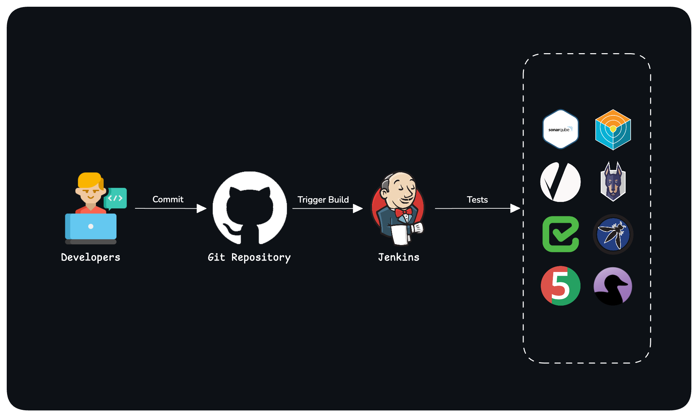

# CI/CD Testing Strategies

Brief overview of common testing types and tools used in CI/CD pipelines.

  

## Testing Types

### Unit Tests
**What**: Test individual functions/components in isolation  
**Why**: Fast feedback, catch bugs early, enable safe refactoring  
**Tools**: JUnit (Java), Jest (JavaScript), pytest (Python), NUnit (C#)

### Integration Tests
**What**: Test how components work together  
**Why**: Verify data flow between systems, catch interface issues  
**Tools**: REST Assured, Postman, Testcontainers, Pact

### End-to-End Tests
**What**: Test complete user workflows  
**Why**: Validate entire application flow from user perspective  
**Tools**: Selenium, Cypress, Playwright, Puppeteer

## Code Coverage

### Code Coverage Tools
**What**: Measure how much code is executed during tests  
**Why**: Identify untested code, ensure adequate test coverage, quality gates  

**Popular Tools**:
- **JaCoCo** - Java code coverage
- **Istanbul/nyc** - JavaScript/Node.js  
- **Coverage.py** - Python
- **SimpleCov** - Ruby
- **go test -cover** - Go built-in
- **dotCover** - .NET

## Static Code Analysis

### SonarQube
**What**: Comprehensive code quality and security analysis platform  
**Why**: Detect bugs, vulnerabilities, code smells, and technical debt  
**Features**: Multi-language support, quality gates, security hotspots, coverage reports

### Linters
**What**: Analyze code without executing it  
**Why**: Enforce coding standards, catch common mistakes, improve code quality  

**Popular Tools**:
- **ESLint** - JavaScript/TypeScript
- **Pylint** - Python  
- **Checkstyle** - Java
- **golint** - Go
- **StyleCop** - C#

## Security Testing

### Snyk
**What**: Developer-first security platform  
**Why**: Find vulnerabilities in dependencies, containers, and IaC  
**Scans**: Dependencies, Docker images, Kubernetes, Terraform

### Trivy
**What**: Comprehensive security scanner  
**Why**: Lightweight, fast vulnerability scanning  
**Scans**: Container images, filesystems, Git repos, cloud configs

### Black Duck
**What**: Enterprise software composition analysis  
**Why**: Comprehensive open source security and license compliance  
**Features**: Binary analysis, snippet detection, policy management

### OWASP Tools

#### OWASP ZAP
**What**: Web application security testing proxy  
**Why**: Free DAST tool for finding web app vulnerabilities  
**Use**: Automated scans, manual testing, API security

#### OWASP Dependency-Check
**What**: Identifies known vulnerabilities in dependencies  
**Why**: Check project dependencies against CVE database  
**Supports**: Java, .NET, JavaScript, Python, Ruby, PHP

### Additional Security Tools
- **Semgrep** - Fast static analysis with custom rules
- **CodeQL** - Semantic code analysis (GitHub native)
- **Checkmarx** - Enterprise SAST/IAST/SCA platform

## Performance Testing

### Load Testing
**What**: Simulate expected user traffic  
**Why**: Ensure system handles normal load  
**Tools**: JMeter, Gatling, k6

### Stress Testing  
**What**: Test beyond normal capacity  
**Why**: Find breaking points and system limits  
**Tools**: Artillery, Locust

## Best Practices

1. **Follow testing pyramid** - More unit tests, fewer E2E tests
2. **Fail fast** - Run quick tests first
3. **Parallel execution** - Speed up pipeline
4. **Security scanning** - Every build should include security checks
5. **Quality gates** - Set thresholds for test coverage and security 