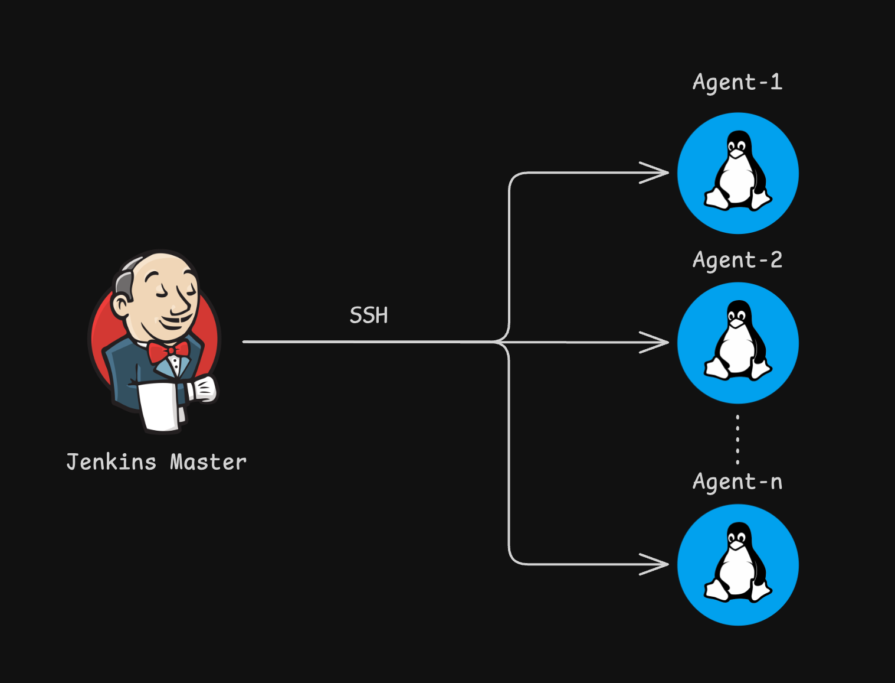
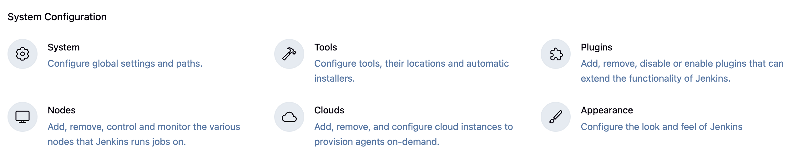
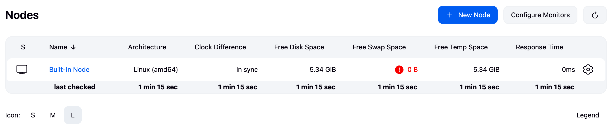
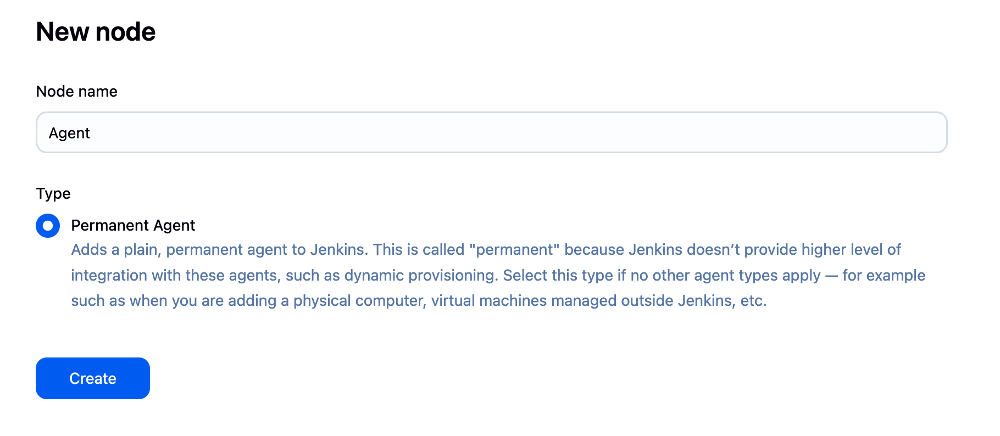
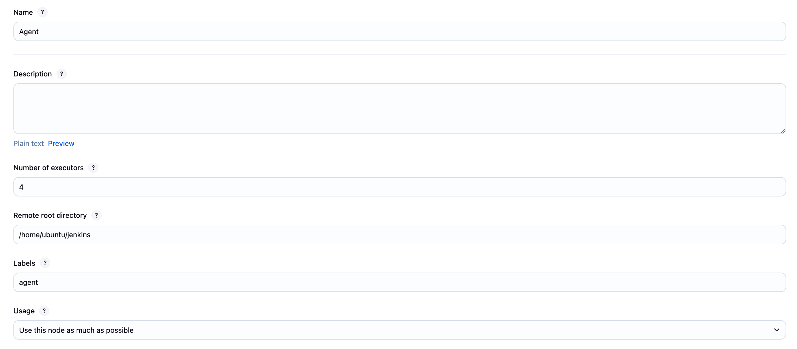
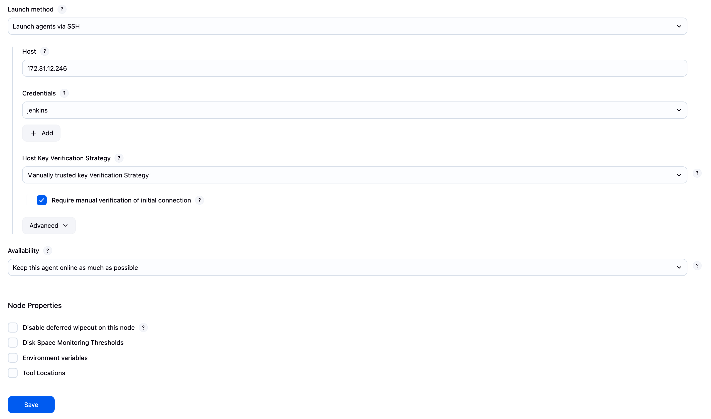

# Setting Up Jenkins Agents

Jenkins agents (formerly called slaves) allow you to distribute builds across multiple machines. This guide walks you through adding a new agent to your Jenkins master.

## What are Jenkins Agents?

Jenkins uses a master-agent architecture where:
- **Master**: Manages the Jenkins UI, job configurations, and schedules builds
- **Agents**: Execute the actual build jobs

<div align="center">
  
</div>

### Benefits of Using Agents
- **Scalability**: Distribute load across multiple machines
- **Platform diversity**: Run builds on different OS (Windows, Linux, macOS)
- **Resource isolation**: Dedicated resources for specific projects
- **Security**: Keep build environments separate from master

## Prerequisites

Before adding an agent, ensure:
1. Jenkins master is running and accessible
2. Target machine for agent has:
   - Java installed (same major version as master)
   - Network connectivity to Jenkins master
   - Sufficient resources (CPU, RAM, disk space)

## Step-by-Step Guide to Adding an Agent

### Step 1: Access Jenkins Management

Navigate to your Jenkins dashboard and click on **Manage Jenkins**.

<div align="center">
  
</div>

### Step 2: Navigate to Nodes Configuration

From the Manage Jenkins page, click on **Manage Nodes and Clouds** (or **Manage Nodes** in older versions).

### Step 3: Create New Node

Click on **New Node** to start adding a new agent.

<div align="center">
  
</div>

### Step 4: Configure Node Name

Enter a descriptive name for your agent and select **Permanent Agent**.

<div align="center">
  
</div>

**Naming Best Practices:**
- Use descriptive names (e.g., `linux-build-agent-01`, `windows-test-agent`)
- Include OS type if relevant
- Add numbers for multiple similar agents
- Avoid spaces (use hyphens or underscores)

### Step 5: Configure Agent Details - Part 1

Configure the basic agent settings:

<div align="center">
  
</div>

#### Key Configuration Options:

**Name**
- Already set in previous step
- Cannot be changed after creation

**Description**
- Add details about the agent's purpose
- Include OS version, installed tools, etc.

**Number of executors**
- Number of concurrent builds this agent can run
- Typically set to number of CPU cores
- Start with 1-2 for testing

**Remote root directory**
- Workspace directory on the agent machine
- Examples:
  - Linux: `/var/jenkins`
  - Windows: `C:\jenkins`
- Must be writable by the agent process

**Labels**
- Tags to identify agent capabilities
- Examples: `linux`, `docker`, `nodejs`, `python3`
- Jobs can target specific labels

**Usage**
- **Use this node as much as possible**: Default, any job can use
- **Only build jobs with label expressions matching this node**: Restricted

### Step 6: Configure Agent Details - Part 2

Continue with launch method and advanced settings:

<div align="center">
  
</div>

#### Launch Method Options:

**1. Launch agent by connecting it to the master/controller**
- Agent initiates connection to master
- Good for agents behind firewalls
- Requires manual start or service setup

**2. Launch agent via SSH**
- Master connects to agent via SSH
- Requires SSH access from master to agent
- Most common for Linux agents

**3. Launch agent via Windows service**
- For Windows agents
- Runs as Windows service

#### Additional Configuration:

**Availability**
- **Keep this agent online as much as possible**: Normal operation
- **Bring this agent online according to a schedule**: Time-based
- **Bring this agent online when in demand**: On-demand scaling

**Node Properties**
- Environment variables
- Tool locations
- Additional configurations

## Connection Methods Deep Dive

### SSH Connection (Linux/macOS)

**Prerequisites:**
1. SSH server running on agent
2. SSH key or password authentication
3. Java installed on agent

**Configuration:**
```bash
Host: agent-hostname.example.com/<ip-address>
Credentials: Select or add SSH credentials
Port: 22
```

**Advanced SSH Options:**
- Prefix/Suffix commands
- Connection timeout
- Key verification strategy

### JNLP Connection (Any Platform)

**Steps:**
1. Save agent configuration
2. Download agent.jar from Jenkins
3. Run on agent machine:
```bash
java -jar agent.jar -jnlpUrl http://jenkins:8080/computer/AGENT_NAME/slave-agent.jnlp -secret SECRET_KEY -workDir /path/to/workspace
```

## Best Practices

### Planning
1. **Capacity Planning**
   - Calculate needed executors
   - Plan for peak loads
   - Consider cloud agents for scaling

2. **Agent Organization**
   - Group by capability (labels)
   - Separate by environment
   - Dedicated agents for critical jobs

### Maintenance
1. **Regular Updates**
   - Keep Java updated
   - Update agent.jar periodically
   - Patch OS regularly

2. **Monitoring**
   - Track agent availability
   - Monitor resource usage
   - Set up alerts for offline agents


## Agent Management Commands

### Via Jenkins CLI
```bash
# List agents
java -jar jenkins-cli.jar -s http://jenkins:8080/ list-nodes

# Take agent offline
java -jar jenkins-cli.jar -s http://jenkins:8080/ offline-node AGENT_NAME

# Bring agent online
java -jar jenkins-cli.jar -s http://jenkins:8080/ online-node AGENT_NAME
```

## Summary

Adding agents to Jenkins enables:
- Distributed builds across multiple machines
- Better resource utilization
- Platform-specific build environments
- Improved build performance and reliability

Start with a simple SSH-based Linux agent, then expand based on your needs. Remember to monitor agent health and maintain security best practices.
