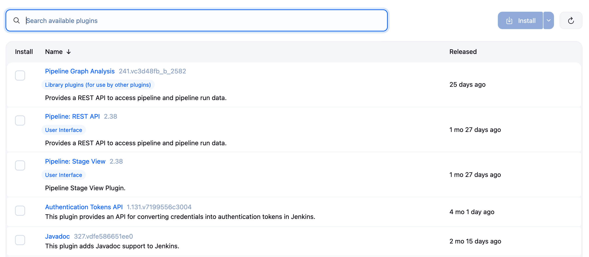

# Jenkins Plugins Guide

Jenkins' extensibility through plugins is one of its greatest strengths. With over 1,800 plugins available, Jenkins can integrate with virtually any tool in your development stack.

  

## Understanding Jenkins Plugins

### What are Plugins?
- Extensions that add functionality to Jenkins
- Written in Java and packaged as `.hpi` files
- Can modify UI, add build steps, integrate tools, and more

### Plugin Management
- **Install**: Manage Jenkins → Manage Plugins → Available
- **Update**: Manage Jenkins → Manage Plugins → Updates
- **Configure**: Manage Jenkins → Configure System (for most plugins)

## Pre-installed Essential Plugins

These plugins come with Jenkins and provide core functionality:

### 1. **Git Plugin**
- **Purpose**: Git repository integration
- **Features**: Clone, checkout, branch management
- **Why Essential**: Most projects use Git for version control

### 2. **Pipeline Plugin**
- **Purpose**: Enables Pipeline as Code
- **Features**: Jenkinsfile support, stage visualization
- **Why Essential**: Modern CI/CD best practice

### 3. **Credentials Plugin**
- **Purpose**: Secure credential storage
- **Features**: Multiple credential types, encryption
- **Why Essential**: Security foundation for Jenkins

### 4. **Workspace Cleanup Plugin**
- **Purpose**: Clean workspaces before/after builds
- **Features**: Selective deletion, pattern matching
- **Why Essential**: Prevents disk space issues

## Plugin Categories

## 🔒 Security Plugins

### Role-Based Authorization Strategy
**Purpose**: Fine-grained access control using roles and permissions

**Key Features:**
- Create custom roles with specific permissions
- Assign roles to users/groups
- Project-based security
- Better than basic matrix authorization

### AWS Credentials Plugin
**Purpose**: Manage AWS credentials securely in Jenkins

**Key Features:**
- Store AWS Access/Secret keys
- IAM role support
- Temporary credential generation
- Integration with AWS SDK

## 🎨 UI/UX Enhancement Plugins

### Blue Ocean
**Purpose**: Modern, visual pipeline UI for Jenkins

**Key Features:**
- Visual pipeline editor
- Real-time pipeline visualization
- Git integration
- Better error reporting
- Mobile-responsive design

**Access**: After installation, access via `/blue` URL path

## 🔄 Build Trigger Plugins

### Generic Webhook Trigger
**Purpose**: Trigger builds from any webhook source

**Key Features:**
- Extract values from JSON/XML payloads
- Conditional triggering based on payload
- Support for any webhook provider
- Token-based authentication

### Parameterized Trigger Plugin
**Purpose**: Trigger downstream builds with parameters

**Key Features:**
- Pass parameters between jobs
- Conditional triggering
- Build result-based triggers
- Parameter factories for dynamic values

## 📊 Code Quality Plugins

### SonarQube Scanner
**Purpose**: Integrate code quality analysis into Jenkins builds

**Key Features:**
- Automatic code analysis
- Quality gate enforcement
- Multi-language support
- Trend analysis

## 🚀 Deployment & Publishing Plugins

### Publish Over SSH
**Purpose**: Deploy files and execute commands on remote servers via SSH

**Key Features:**
- Multiple server configuration
- File transfer with patterns
- Remote command execution
- Pre/post transfer commands

## 📧 Notification Plugins

### Email Extension Plugin
**Purpose**: Advanced email notifications with customization

**Key Features:**
- HTML emails with templates
- Conditional recipients
- Attachments support
- Multiple triggers
- Custom email content

## ⚙️ Build Management Plugins

### Build Timeout
**Purpose**: Automatically abort builds that run too long

**Key Features:**
- Absolute timeout
- Deadline timeout
- Elastic timeout
- Activity-based timeout

**Why Important:**
- Prevents hung builds
- Frees up resources
- Maintains build queue health

## Recommended Plugin Sets

### For Small Teams
- Git
- Pipeline
- Blue Ocean
- Email Extension
- Credentials

### For Enterprise
- Role-Based Authorization
- Active Directory/LDAP
- Audit Trail
- Job Configuration History
- Backup

### For Cloud-Native
- Kubernetes
- Docker Pipeline
- AWS/Azure/GCP plugins
- HashiCorp Vault
- Prometheus Metrics

## Summary

Jenkins plugins extend functionality across:
- **Security**: Fine-grained access control
- **Integration**: Connect with any tool
- **UI/UX**: Modern interfaces
- **Automation**: Advanced triggers and notifications

The right combination of plugins transforms Jenkins from a simple CI server into a powerful automation platform tailored to your needs. 