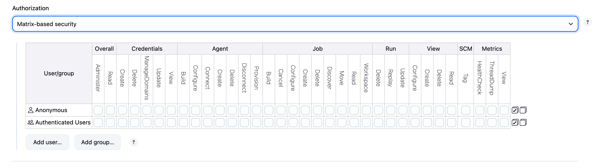

# Jenkins Authorization Strategies

Jenkins provides several authorization strategies to control who can do what in your Jenkins instance. This guide covers Matrix-based security and Project-based authorization, two of the most commonly used strategies.

## Overview of Authorization Strategies

Jenkins offers several authorization strategies:
- **Anyone can do anything** - No security (not recommended)
- **Legacy mode** - Basic authentication
- **Logged-in users can do anything** - Simple but limited
- **Matrix-based security** - Fine-grained global permissions
- **Project-based Matrix Authorization** - Per-project permissions
- **Role-Based Strategy** - Role-based access control (requires plugin)

<div align="center">
  
</div>

## Matrix-Based Security

Matrix-based security allows you to define permissions for users and groups at the global level using a permission matrix.

### Key Features
- **Granular permissions** - Control specific actions
- **User and group support** - Assign permissions to individuals or groups
- **Global scope** - Permissions apply to entire Jenkins instance
- **Visual matrix** - Easy to see who has what permissions

### Setting Up Matrix-Based Security

1. **Navigate to Security Configuration**
   - Manage Jenkins → Configure Global Security
   - Under Authorization, select "Matrix-based security"

2. **Understanding Permission Categories**

   **Overall**
   - Administer - Full system administration
   - Read - View Jenkins

   **Agent**
   - Build - Build on agents
   - Configure - Configure agents
   - Connect - Connect agents
   - Create - Create new agents
   - Delete - Remove agents
   - Disconnect - Disconnect agents

   **Job**
   - Build - Trigger builds
   - Cancel - Stop running builds
   - Configure - Modify job configuration
   - Create - Create new jobs
   - Delete - Remove jobs
   - Discover - See job exists (without read)
   - Move - Move jobs to folders
   - Read - View job and build history
   - Workspace - Access job workspace

   **Run**
   - Delete - Delete specific builds
   - Replay - Replay pipeline builds
   - Update - Update build information

   **View**
   - Configure - Modify views
   - Create - Create new views
   - Delete - Remove views
   - Read - See views

3. **Adding Users/Groups**
   - Click "Add user or group"
   - Enter username or group name
   - Check appropriate permissions

### Best Practices for Matrix Security

```
Admin Users:
✓ Overall: Administer
✓ All other permissions (inherited from Administer)

Developers:
✓ Overall: Read
✓ Job: Build, Cancel, Configure, Create, Read, Workspace
✓ Run: Replay, Update
✓ View: Read
✗ Agent permissions (unless needed)
✗ Delete permissions

QA Team:
✓ Overall: Read
✓ Job: Build, Cancel, Read
✓ Run: Update
✓ View: Read
✗ Configure or Create permissions

Read-Only Users:
✓ Overall: Read
✓ Job: Discover, Read
✓ View: Read
✗ All modification permissions
```

## Project-Based Matrix Authorization

Project-based Matrix Authorization extends matrix-based security by allowing you to set permissions at the job/folder level.

### Key Features
- **Inheritance** - Jobs inherit permissions from parent folders
- **Override capability** - Project-specific permissions
- **Granular control** - Different permissions per project
- **Team isolation** - Teams can manage their own jobs

### Enabling Project-Based Authorization

1. **Install Plugin** (if not already installed)
   - Matrix Authorization Strategy Plugin

2. **Configure Global Security**
   ```
   Manage Jenkins → Configure Global Security
   → Authorization → Project-based Matrix Authorization Strategy
   ```

3. **Set Global Permissions**
   - Define base permissions that apply globally
   - Usually minimal permissions for most users

### Configuring Per-Project Permissions

1. **In Job Configuration**
   ```
   Job → Configure → Enable project-based security
   ```

2. **Add Users/Groups**
   - Similar matrix interface at job level
   - Override or extend global permissions

### Example Scenarios

#### Scenario 1: Team-Based Access
```
Global Level:
- Everyone: Overall/Read, Job/Discover
- Jenkins Admins: Overall/Administer

Frontend Team Folder:
- frontend-developers: Job/*, Run/*, View/Read
- frontend-lead: Job/Configure, Job/Delete

Backend Team Folder:
- backend-developers: Job/*, Run/*, View/Read
- backend-lead: Job/Configure, Job/Delete
```

#### Scenario 2: Environment-Based Access
```
Development Jobs:
- all-developers: Job/Build, Job/Read, Job/Configure
- qa-team: Job/Build, Job/Read

Staging Jobs:
- qa-team: Job/Build, Job/Read, Job/Configure
- developers: Job/Read only

Production Jobs:
- ops-team: Job/Build, Job/Configure
- developers: Job/Read only
- qa-team: Job/Read only
```

## Summary

Authorization strategies in Jenkins provide:
- **Security** - Control who can do what
- **Compliance** - Meet audit requirements
- **Team Autonomy** - Teams manage their own jobs
- **Flexibility** - Different strategies for different needs

Start with matrix-based security for simple needs, upgrade to project-based for complex team structures. Always follow the principle of least privilege and maintain clear documentation of your permission scheme. 