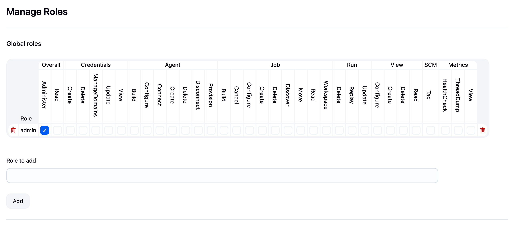
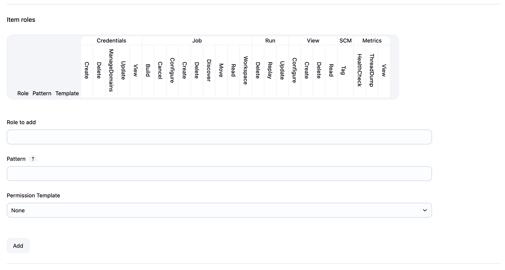
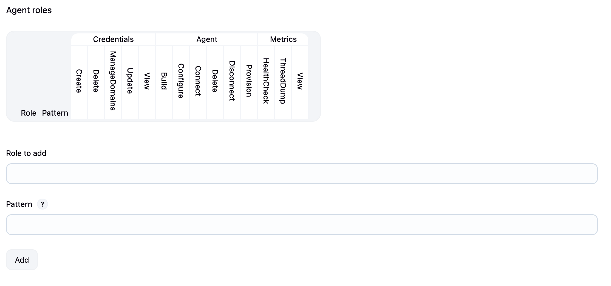

# Jenkins Role-Based Access Control (RBAC)

Role-Based Access Control provides a more flexible and manageable way to handle permissions in Jenkins compared to matrix-based security. With RBAC, you define roles with specific permissions and assign these roles to users or groups.

## What is RBAC?

RBAC allows you to:
- **Define roles** with specific sets of permissions
- **Assign roles** to users and groups
- **Manage permissions** centrally through roles
- **Create hierarchical** permission structures
- **Simplify administration** of large Jenkins instances

## RBAC vs Matrix-Based Security

| Feature | Matrix-Based | RBAC |
|---------|--------------|------|
| Permission Assignment | Direct to users | Through roles |
| Scalability | Limited | Excellent |
| Reusability | None | High |
| Management Overhead | High for many users | Low |
| Flexibility | Per-user granularity | Role-based patterns |

## Installing RBAC Plugin

1. **Navigate to Plugin Manager**
   ```
   Manage Jenkins → Manage Plugins → Available
   ```

2. **Search and Install**
   - Search for "Role-based Authorization Strategy"
   - Install and restart Jenkins

3. **Enable RBAC**
   ```
   Manage Jenkins → Configure Global Security
   → Authorization → Role-Based Strategy
   ```

## RBAC Components

### 1. Global Roles
Define permissions that apply to the entire Jenkins instance.

<div align="center">
  
</div>

### 2. Item Roles (Project Roles)
Define permissions for specific jobs, folders, or patterns.

<div align="center">
  
</div>

### 3. Agent Roles (Node Roles)
Define permissions for Jenkins agents/nodes.

<div align="center">
  
</div>

## Setting Up RBAC

### Step 1: Access Role Management
```
Manage Jenkins → Manage and Assign Roles → Manage Roles
```

### Step 2: Create Global Roles

#### Admin Role
```
Role Name: admin
Permissions:
✓ Overall/Administer
(All other permissions inherited)
```

#### Developer Role
```
Role Name: developer
Permissions:
✓ Overall/Read
✓ Job/Build
✓ Job/Cancel
✓ Job/Read
✓ Job/Workspace
✓ View/Read
```

#### QA Role
```
Role Name: qa-engineer
Permissions:
✓ Overall/Read
✓ Job/Build
✓ Job/Read
✓ Run/Replay
✓ View/Read
```

#### Viewer Role
```
Role Name: viewer
Permissions:
✓ Overall/Read
✓ Job/Read
✓ View/Read
```

### Step 3: Create Item Roles

Item roles use patterns to match job names or folder paths.

#### Frontend Team Role
```
Role Name: frontend-team
Pattern: ^frontend/.*
Permissions:
✓ Job/Build
✓ Job/Cancel
✓ Job/Configure
✓ Job/Create
✓ Job/Delete
✓ Job/Read
✓ Job/Workspace
```

#### Backend Team Role
```
Role Name: backend-team
Pattern: ^backend/.*
Permissions:
✓ Job/Build
✓ Job/Cancel
✓ Job/Configure
✓ Job/Create
✓ Job/Delete
✓ Job/Read
✓ Job/Workspace
```

#### Production Deploy Role
```
Role Name: prod-deployer
Pattern: .*/production/.*
Permissions:
✓ Job/Build
✓ Job/Read
✓ Run/Replay
```

### Step 4: Create Agent Roles

Control who can manage specific agents.

#### Agent Admin Role
```
Role Name: agent-admin
Pattern: .*
Permissions:
✓ Agent/Build
✓ Agent/Configure
✓ Agent/Connect
✓ Agent/Create
✓ Agent/Delete
✓ Agent/Disconnect
```

#### Build Agent Role
```
Role Name: build-user
Pattern: build-agent-.*
Permissions:
✓ Agent/Build
✓ Agent/Connect
```

## Assigning Roles

### Navigate to Role Assignment
```
Manage Jenkins → Manage and Assign Roles → Assign Roles
```

### Global Role Assignment
```
User/Group: john.doe
Roles: ✓ developer

User/Group: qa-team
Roles: ✓ qa-engineer

User/Group: ops-team
Roles: ✓ admin
```

### Item Role Assignment
```
User/Group: frontend-developers
Roles: ✓ frontend-team

User/Group: backend-developers
Roles: ✓ backend-team

User/Group: release-managers
Roles: ✓ prod-deployer
```

## Advanced RBAC Patterns

### Pattern Examples

#### Match Specific Jobs
```
Pattern: ^MyApp$
Matches: Only job named "MyApp"
```

#### Match Folder and Contents
```
Pattern: ^DevOps/.*
Matches: All jobs in DevOps folder
```

#### Match by Environment
```
Pattern: .*/staging/.*
Matches: Any job with "staging" in path
```

#### Match Multiple Patterns
```
Pattern: (.*-build|.*-test)
Matches: Jobs ending with -build or -test
```

### Hierarchical Role Structure

```
jenkins-root/
├── Global Roles
│   ├── admin (full access)
│   ├── developer (general dev access)
│   ├── qa-engineer (test access)
│   └── viewer (read-only)
│
├── Item Roles
│   ├── Team-based
│   │   ├── frontend-team (frontend/.*)
│   │   ├── backend-team (backend/.*)
│   │   └── mobile-team (mobile/.*)
│   │
│   └── Environment-based
│       ├── dev-deployer (.*/dev/.*)
│       ├── staging-deployer (.*/staging/.*)
│       └── prod-deployer (.*/prod/.*)
│
└── Agent Roles
    ├── agent-admin (all agents)
    ├── linux-admin (linux-.*)
    └── windows-admin (windows-.*)
```

## Common RBAC Scenarios

### Scenario 1: Multi-Team Setup
```
Teams: Frontend, Backend, QA, DevOps

Global Roles:
- developer: Basic permissions
- qa-engineer: Testing permissions
- admin: Full access

Item Roles:
- frontend-dev: Pattern "frontend/.*"
- backend-dev: Pattern "backend/.*"
- qa-all: Pattern ".*test.*"

Assignment:
- Frontend team → developer + frontend-dev
- Backend team → developer + backend-dev
- QA team → qa-engineer + qa-all
- DevOps → admin
```

### Scenario 2: Environment-Based Access
```
Environments: Development, Staging, Production

Item Roles:
- dev-access: Pattern ".*/development/.*"
- staging-access: Pattern ".*/staging/.*"
- prod-access: Pattern ".*/production/.*"

Assignment:
- All developers → dev-access
- QA team → dev-access + staging-access
- Ops team → all environments
```

### Scenario 3: Project-Based Isolation
```
Projects: ProjectA, ProjectB, ProjectC

Item Roles:
- projectA-team: Pattern "ProjectA/.*"
- projectB-team: Pattern "ProjectB/.*"
- projectC-team: Pattern "ProjectC/.*"

Each team only sees and manages their project
```


## Summary

RBAC in Jenkins provides:
- **Scalability**: Manage thousands of users efficiently
- **Flexibility**: Pattern-based permission assignment
- **Maintainability**: Central role management
- **Security**: Consistent permission model

Start with simple global roles, add item roles for team/project isolation, and use agent roles for infrastructure access control. Regular audits and good documentation ensure your RBAC implementation remains effective as your Jenkins instance grows. 