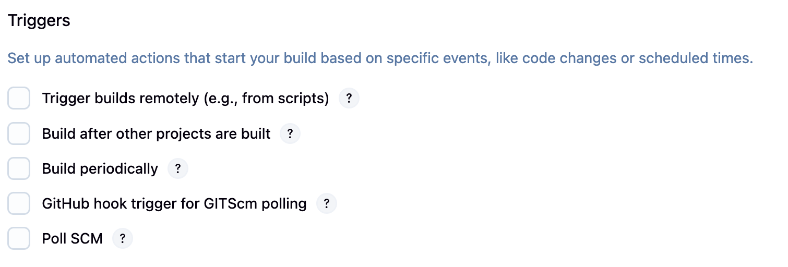

# Jenkins Build Triggers

Build triggers determine when and how Jenkins jobs are executed. Understanding different trigger types helps you automate your CI/CD pipeline effectively.

<div align="center">
  
</div>

## Overview of Build Triggers

Jenkins provides several ways to trigger builds:
- **Manual Trigger** - Build on demand
- **Schedule (Cron)** - Build at specific times
- **Poll SCM** - Check for changes periodically
- **Webhook** - Trigger on external events
- **Build after other projects** - Chain builds together
- **Trigger builds remotely** - API-based triggers

## 1. Build Periodically (Cron)

### What is it?
Schedule builds to run at specific times using cron-like syntax, regardless of code changes.

### When to use?
- Nightly builds
- Regular cleanup tasks
- Scheduled reports generation
- Regular integration tests

### Cron Syntax

```
MINUTE HOUR DOM MONTH DOW
┌───────────── minute (0 - 59)
│ ┌───────────── hour (0 - 23)
│ │ ┌───────────── day of month (1 - 31)
│ │ │ ┌───────────── month (1 - 12)
│ │ │ │ ┌───────────── day of week (0 - 7) (Sunday = 0 or 7)
│ │ │ │ │
* * * * *
```

### Common Examples

| Schedule | Cron Expression | Description |
|----------|----------------|-------------|
| Every 15 minutes | `H/15 * * * *` | Uses Jenkins hash for load distribution |
| Daily at midnight | `H 0 * * *` | Runs between 12:00 AM - 12:59 AM |
| Every Monday at 8 AM | `H 8 * * 1` | Weekly builds |
| Twice daily | `H 9,17 * * *` | At 9 AM and 5 PM |
| Every weekday at 6 PM | `H 18 * * 1-5` | Monday through Friday |

### Best Practices
- Use `H` (hash) instead of specific minutes to distribute load
- Avoid scheduling all jobs at the same time
- Consider timezone differences for distributed teams

### Example Configuration
```
# Build every day at 2 AM
H 2 * * *

# Build every 30 minutes during business hours
H/30 9-17 * * 1-5
```

## 2. Poll SCM

### What is it?
Jenkins periodically checks your source control system for changes and builds only when changes are detected.

### When to use?
- When webhooks are not available
- Behind corporate firewalls
- Legacy SCM systems
- As a backup to webhooks

### How it works
1. Jenkins connects to your SCM at scheduled intervals
2. Checks if there are new commits since last build
3. Triggers build only if changes are found
4. Records the latest revision built

### Poll SCM Syntax
Uses the same cron syntax as "Build Periodically" but only builds when changes are detected.

### Common Patterns

```bash
# Check every 5 minutes
H/5 * * * *

# Check every hour during business hours
H 9-17 * * 1-5

# Check twice per hour
H/30 * * * *
```

### Advantages
- Only builds when there are actual changes
- Works with any SCM system
- No external configuration needed

### Disadvantages
- Creates load on SCM server
- Delayed feedback (waits for next poll)
- Consumes Jenkins resources

## 3. GitHub Webhook

### What is it?
GitHub sends a notification to Jenkins immediately when code is pushed, triggering an instant build.

### When to use?
- Immediate feedback needed
- Using GitHub/GitLab/Bitbucket
- Want to minimize server load
- Real-time CI/CD pipeline

### How Webhooks Work
```
Developer pushes code → GitHub → Webhook → Jenkins → Build starts
                         ↓
                    (Instant notification)
```

### Setup Steps

#### Step 1: Configure Jenkins
1. Install **GitHub plugin** (usually pre-installed)
2. In job configuration, check **"GitHub hook trigger for GITScm polling"**
3. Note your Jenkins URL: `http://your-jenkins-url/github-webhook/`

#### Step 2: Configure GitHub Repository
1. Go to your GitHub repository
2. Navigate to **Settings** → **Webhooks**
3. Click **"Add webhook"**
4. Configure:
   - **Payload URL**: `http://your-jenkins-url/github-webhook/`
   - **Content type**: `application/json`
   - **Events**: Select "Just the push event" or customize
   - **Active**: ✓ Check

### Webhook Events
Common events that can trigger builds:
- **Push** - Code pushed to repository
- **Pull Request** - PR opened/updated
- **Release** - New release created

### Troubleshooting Webhooks

#### Check Webhook Delivery
1. Go to GitHub → Settings → Webhooks
2. Click on your webhook
3. Check "Recent Deliveries" tab
4. Look for ✓ (success) or ✗ (failure)

#### Common Issues
- **Jenkins URL not accessible** - Check firewall/network settings
- **Authentication required** - Configure Jenkins security accordingly
- **Wrong URL format** - Ensure `/github-webhook/` is included

## Comparison Table

| Feature | Build Periodically | Poll SCM | GitHub Webhook |
|---------|-------------------|-----------|----------------|
| **Trigger Speed** | Scheduled | Delayed (next poll) | Instant |
| **Server Load** | Low | High (polling) | Minimal |
| **Network Requirements** | None | Outbound to SCM | Inbound from GitHub |
| **Configuration** | Simple | Simple | Moderate |
| **Use Case** | Scheduled tasks | Legacy systems | Modern CI/CD |

## Combining Triggers

You can use multiple triggers for redundancy:

```groovy
// Jenkinsfile example
properties([
    pipelineTriggers([
        // Primary: GitHub webhook
        githubPush(),
        
        // Backup: Poll every hour
        pollSCM('H * * * *'),
        
        // Nightly build regardless of changes
        cron('H 2 * * *')
    ])
])
```

## Summary

Choose the right trigger based on your needs:
- **Build Periodically**: For scheduled, time-based tasks
- **Poll SCM**: When webhooks aren't available
- **GitHub Webhook**: For instant feedback and modern CI/CD

Remember that triggers can be combined for reliability and different use cases. Modern best practice favors webhooks for code changes and cron for scheduled maintenance tasks. 