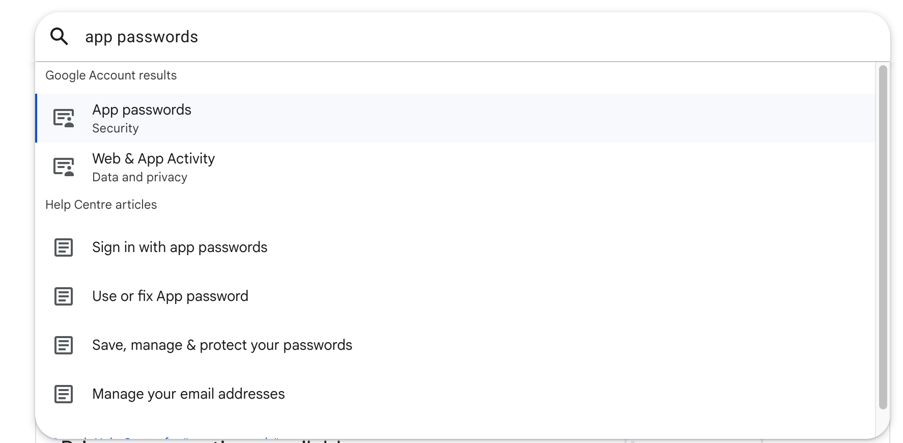
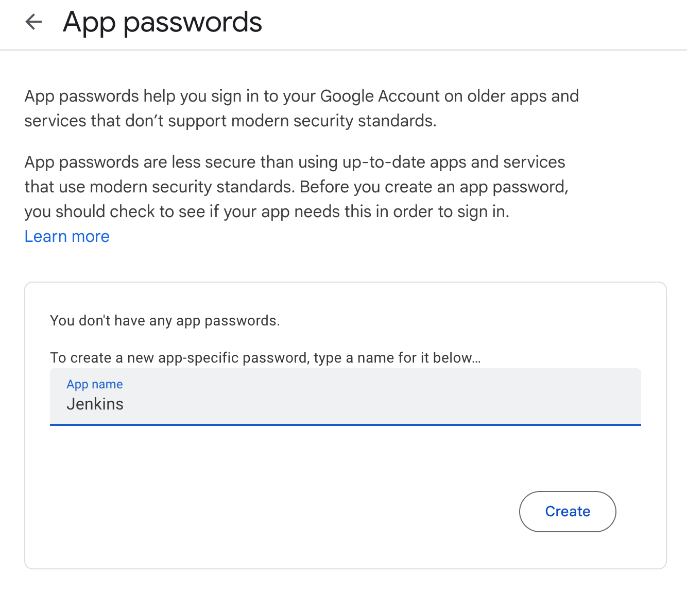
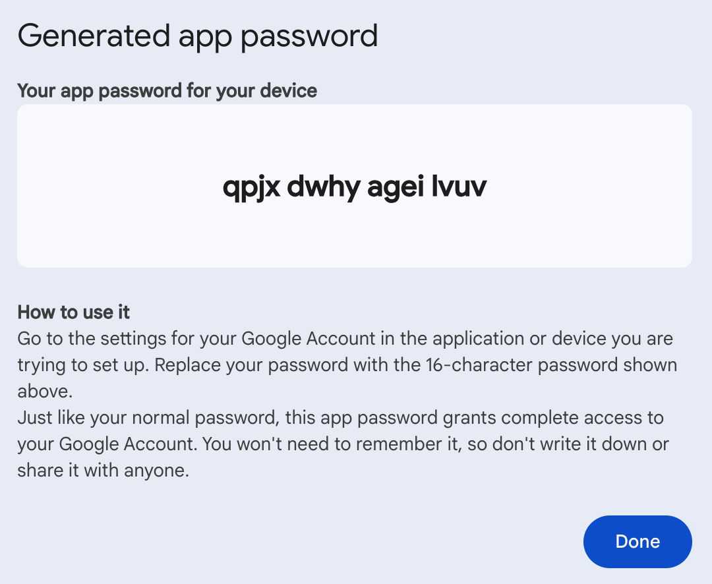
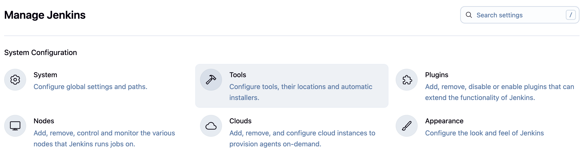
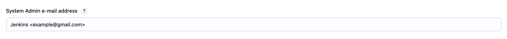
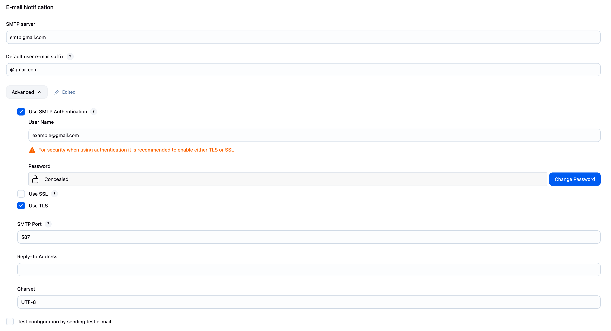

# Configuring Gmail SMTP in Jenkins

This guide will walk you through setting up Gmail SMTP server in Jenkins for sending email notifications about build status, failures, and other important events.

## Prerequisites

- Jenkins installed and running
- A Gmail account
- 2-Step Verification enabled on your Google account (required for App Passwords)

## Step 1: Generate Gmail App Password

Since Google has discontinued support for less secure apps, you need to create an App Password to use Gmail SMTP with Jenkins.

### 1.1 Access Google Account Settings

Go to [https://myaccount.google.com/](https://myaccount.google.com/) and sign in to your Google account.

### 1.2 Search for App Passwords

In the search bar, type "App passwords" to quickly find the setting.

<div align="center">
  
</div>

### 1.3 Create New App Password

Click on "App passwords" and then create a new app password for Jenkins.

<div align="center">
  
</div>

**Important Notes:**
- You must have 2-Step Verification enabled


### 1.4 Copy the Generated Password

Google will generate a 16-character password. **Copy this password immediately** as you won't be able to see it again.

<div align="center">
  
</div>

⚠️ **Security Tip**: Store this password securely. Treat it like your main Google password.

## Step 2: Configure Jenkins Email Settings

### 2.1 Access Jenkins System Configuration

Navigate to **Manage Jenkins** → **System**

<div align="center">
  
</div>

### 2.2 Configure System Admin Email

Scroll down to the **Jenkins Location** section and set the System Admin e-mail address. This should be the same Gmail address you're using for SMTP.

<div align="center">
  
</div>

### 2.3 Configure E-mail Notification

Scroll down to the **E-mail Notification** section and configure the SMTP settings:

<div align="center">
  
</div>

Use these settings:
- **SMTP server**: `smtp.gmail.com`
- **Default user e-mail suffix**: `@gmail.com`
- Click **Advanced** to reveal more options:
  - **Use SMTP Authentication**: ✓ Check this
  - **User Name**: Your full Gmail address (e.g., `yourname@gmail.com`)
  - **Password**: The 16-character App Password from Step 1.4
  - **Use TLS**: ✓ Check this (preferred over SSL)
  - **SMTP Port**: `587`

### 2.4 Test Configuration

Before saving:
1. Check the box **"Test configuration by sending test e-mail"**
2. Enter a recipient email address
3. Click **"Test configuration"**

If successful, you'll see a message saying "Email was successfully sent" and receive a test email.

## Step 3: Configure Extended E-mail Notification (Optional)

For more advanced email configurations, install the **Email Extension Plugin**:

1. Go to **Manage Jenkins** → **Manage Plugins**
2. Search for "Email Extension Plugin"
3. Install the plugin
4. Configure it in **Manage Jenkins** → **Configure System** → **Extended E-mail Notification**

This plugin provides:
- Custom email templates
- Conditional sending based on build status
- Attachments support
- Multiple recipient lists
- HTML emails

## Setting Up Email Notifications in Jobs

### Freestyle Projects
1. In your job configuration, scroll to **Post-build Actions**
2. Add **E-mail Notification**
3. Enter recipient emails
4. Choose when to send emails (on failure, success, etc.)

### Pipeline Projects
```groovy
pipeline {
    agent any
    stages {
        stage('Build') {
            steps {
                echo 'Building...'
            }
        }
    }
    post {
        failure {
            mail to: 'team@example.com',
                 subject: "Failed Pipeline: ${currentBuild.fullDisplayName}",
                 body: "Something is wrong with ${env.BUILD_URL}"
        }
        success {
            mail to: 'team@example.com',
                 subject: "Successful Pipeline: ${currentBuild.fullDisplayName}",
                 body: "Build successful: ${env.BUILD_URL}"
        }
    }
}
```

## Summary

You've successfully configured Jenkins to send emails through Gmail SMTP. Your Jenkins instance can now:
- Send build failure notifications
- Alert teams about successful deployments
- Send custom email notifications based on build events

Remember to test your configuration thoroughly and follow security best practices to keep your Jenkins instance and Gmail account secure.