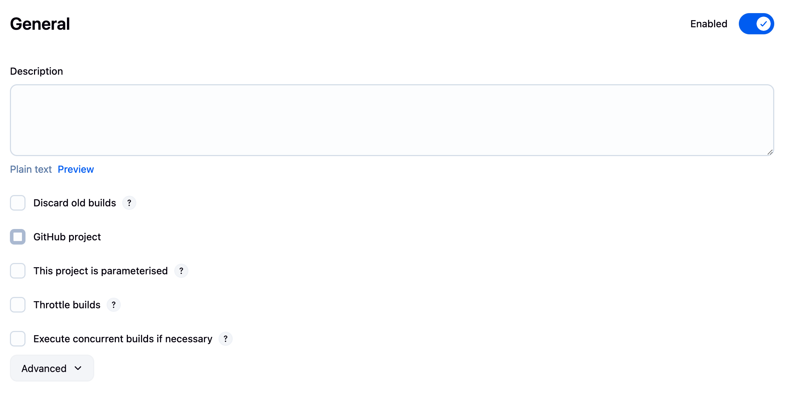
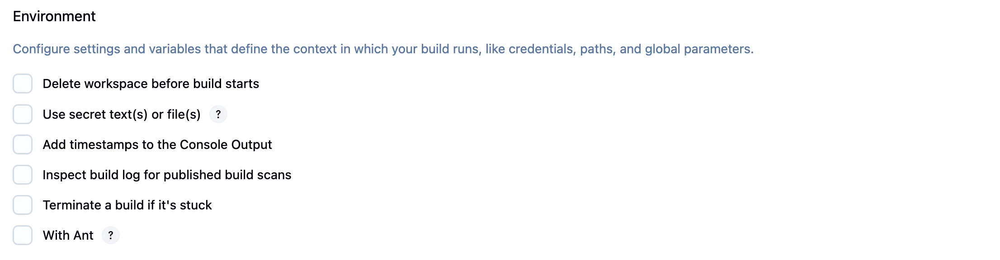
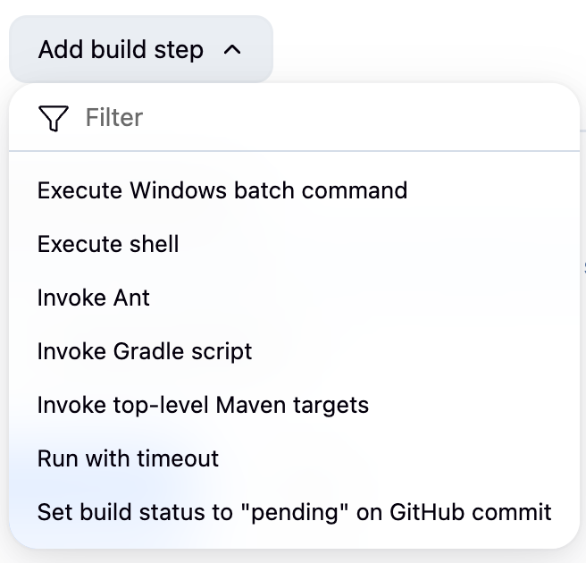
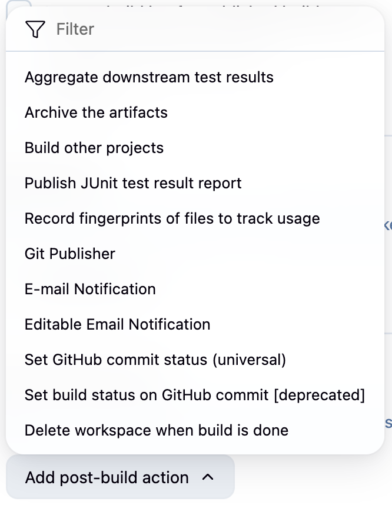

# Jenkins Job Configuration Guide

This guide provides a detailed explanation of all configuration options available when creating or configuring a Jenkins job. Each section includes screenshots and explanations of every available option.

## 1. General Configuration

<div align="center">
  
</div>

### Project Name
- **Purpose**: Identifies your job uniquely in Jenkins
- **Best Practice**: Use descriptive names with consistent naming conventions (e.g., `project-env-type`)

### Description
- **Purpose**: Provides context about what the job does
- **Best Practice**: Include purpose, owner, and any special requirements
- **Supports**: HTML formatting for better readability

### Discard Old Builds
- **Purpose**: Manages disk space by removing old build artifacts and logs
- **Options**:
  - **Days to keep builds**: Number of days to retain build records
  - **Max # of builds to keep**: Maximum number of builds to retain
  - **Days to keep artifacts**: Number of days to retain build artifacts
  - **Max # of builds to keep with artifacts**: Maximum builds with artifacts
- **Best Practice**: Balance between history needs and disk space

### This project is parameterized
- **Purpose**: Allows passing parameters to builds at runtime
- **Types**:
  - **String Parameter**: Text input
  - **Choice Parameter**: Dropdown selection
  - **Boolean Parameter**: Checkbox
  - **File Parameter**: Upload files
  - **Password Parameter**: Secure text input
- **Use Case**: Different configurations for dev/staging/prod environments

### Throttle Builds
- **Purpose**: Limits concurrent builds to prevent resource exhaustion
- **Options**:
  - **Maximum concurrent builds per project**
  - **Maximum concurrent builds per node**
- **Use Case**: Resource-intensive builds or shared resources

### Disable this project
- **Purpose**: Temporarily prevents the job from running
- **Use Case**: Maintenance or troubleshooting without deleting the job

### Execute concurrent builds if necessary
- **Purpose**: Allows multiple instances of the same job to run simultaneously
- **Warning**: Ensure your job is designed for concurrent execution
- **Use Case**: Independent builds that don't share workspace or resources

## 2. Source Code Management (SCM)

<div align="center">
  
</div>

### None
- **Purpose**: No source code checkout
- **Use Case**: Jobs that don't require source code (maintenance tasks, deployments)

### Git
- **Repository URL**: URL to your Git repository
- **Credentials**: Authentication for private repositories
  - **Types**: Username/password, SSH key, access token
  - **Scope**: System-wide or job-specific
- **Branches to build**:
  - **Branch Specifier**: Which branches to build (e.g., `*/main`, `*/develop`, `feature/*`)
  - **Wildcards**: Use `*` for pattern matching

## 3. Build Triggers

<div align="center">
  
</div>

### Available Triggers
- **Build after other projects are built**: Chain jobs together
- **Build periodically**: Schedule builds using cron syntax
- **GitHub hook trigger for GITScm polling**: Webhook-based triggering
- **Poll SCM**: Periodically check for source changes
- **Trigger builds remotely**: API-based triggering with authentication token

📚 **For detailed information about triggers, see our [Build Triggers Guide](./Build-Triggers.md)**

## 4. Build Environment

<div align="center">
  
</div>

### Delete workspace before build starts
- **Purpose**: Ensures clean workspace for each build
- **When to use**: Builds with file conflicts or caching issues
- **Performance**: Increases build time but ensures consistency

### Use secret text(s) or file(s)
- **Purpose**: Inject secrets into build environment
- **Types**:
  - **Secret text**: Environment variables with sensitive data
  - **Secret file**: Files containing credentials or certificates
- **Security**: Values are masked in console output

### Add timestamps to the Console Output
- **Purpose**: Adds timestamp to each line of console output
- **Benefits**: Easier debugging and performance analysis
- **Format**: `[2024-01-15 10:30:45] Build step started...`

### Inspect build log for published build scans
- **Purpose**: Detects and links to Gradle/Maven build scans
- **Benefits**: Detailed build performance insights

### Set Build Name
- **Purpose**: Custom build display name instead of build number
- **Variables**: Use environment variables like `${ENV,var="BRANCH_NAME"}`
- **Example**: `#${BUILD_NUMBER}-${GIT_BRANCH}`

### Set GitHub commit status
- **Purpose**: Updates PR/commit status in GitHub
- **Contexts**: Continuous integration status reporting
- **States**: Pending, Success, Failure, Error

## 5. Build Steps

<div align="center">
  
</div>

### Execute Shell
- **Purpose**: Run shell commands (Linux/Mac)
- **Working Directory**: Executes in job workspace
- **Exit Code**: Non-zero exits fail the build
- **Example**:
  ```bash
  #!/bin/bash
  echo "Building project..."
  npm install
  npm run build
  npm test
  ```

### Execute Windows Batch Command
- **Purpose**: Run batch commands (Windows)
- **Variables**: Access Jenkins environment variables with `%VAR_NAME%`
- **Example**:
  ```batch
  echo Building on Windows...
  call npm install
  call npm run build
  ```

### Invoke Gradle Script
- **Purpose**: Run Gradle builds
- **Options**:
  - **Gradle Version**: Select from configured installations
  - **Tasks**: Specify tasks (e.g., `clean build test`)
  - **Root Build Script**: Path to build.gradle
  - **Gradle Wrapper**: Use project's gradlew

### Invoke Top-Level Maven Targets
- **Purpose**: Run Maven builds
- **Options**:
  - **Maven Version**: Select from configured installations
  - **Goals**: Specify goals (e.g., `clean install`)
  - **POM**: Path to pom.xml
  - **Properties**: Additional Maven properties

### Send Files Over SSH
- **Purpose**: Deploy files to remote servers
- **Configuration**:
  - **SSH Server**: Pre-configured SSH connection
  - **Source files**: Files to transfer (supports wildcards)
  - **Remove prefix**: Strip directory structure
  - **Remote directory**: Destination path
  - **Exec command**: Commands to run after transfer

## 6. Post-Build Actions

<div align="center">
  
</div>

### Archive the Artifacts
- **Purpose**: Save build outputs for later use
- **Files to archive**: Patterns like `target/*.jar`, `dist/**/*`
- **Advanced Options**:
  - **Exclude**: Patterns to exclude
  - **Archive only if successful**: Skip on failed builds
  - **Fingerprint**: Track artifact usage across jobs

### Publish JUnit Test Result Report
- **Purpose**: Display test results in Jenkins UI
- **Test report XMLs**: Pattern like `**/target/surefire-reports/*.xml`
- **Features**:
  - Test trends over time
  - Failed test tracking
  - Test duration analysis

### Email Notification
- **Purpose**: Send build status emails
- **Recipients**: Space-separated email addresses
- **Triggers**:
  - **Send for every unstable build**
  - **Send separate emails to individuals who broke the build**
  - **Send to developers**

### Editable Email Notification
- **Purpose**: Advanced email configuration
- **Features**:
  - Custom email templates
  - Conditional recipients
  - Attachments
  - HTML content

### Build Other Projects
- **Purpose**: Trigger downstream jobs
- **Options**:
  - **Projects to build**: Comma-separated job names
  - **Trigger only if stable**: Skip if current build failed
  - **Trigger parameters**: Pass parameters to downstream jobs

### Delete Workspace When Build is Done
- **Purpose**: Clean up workspace after build
- **Options**:
  - **Delete only if build succeeds**
  - **Delete only if build fails**
  - **Include/Exclude patterns**

### Git Publisher
- **Purpose**: Push changes back to Git repository
- **Actions**:
  - **Push Only If Build Succeeds**
  - **Merge Results**: Push merge commits
  - **Tags**: Create and push tags
  - **Branches**: Push to specific branches

## Summary

Understanding these configuration options helps you:
- Create more reliable and maintainable jobs
- Optimize build performance
- Implement proper security practices
- Troubleshoot issues more effectively

Each option serves a specific purpose, and the right combination depends on your project's needs. Start with basic configurations and add complexity as requirements grow.