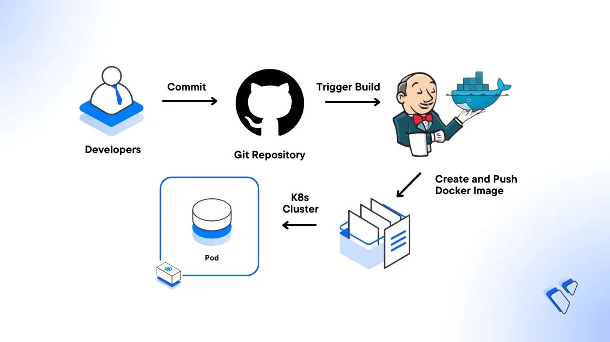

# Jenkins Training Materials

<div align="center">
  
</div>

## 📚 Course Overview

This comprehensive Jenkins training is organized into progressive modules, taking you from basics to advanced topics. Each section builds upon previous knowledge to ensure a smooth learning experience.

## 🎯 Learning Path

### 01 - Getting Started
Foundation concepts for working with Jenkins
- **[Understanding Job Types](./01-getting-started/01-job-types.md)** - Freestyle, Pipeline, Multibranch, and more
- **[Job Configuration Guide](./01-getting-started/02-job-configuration.md)** - Complete configuration walkthrough

### 02 - Build Automation
Automate your build processes effectively
- **[Build Triggers](./02-build-automation/01-build-triggers.md)** - Webhooks, polling, and scheduled builds
- **[Cron Scheduling](./02-build-automation/02-cron-scheduling.md)** - Master Jenkins scheduling syntax with Hash
- **[Background Processes](./02-build-automation/03-background-processes.md)** - Managing long-running tasks

### 03 - Setup and Configuration
Infrastructure and integration setup
- **[Jenkins Agents Setup](./03-setup-and-configuration/01-jenkins-agents.md)** - Distributed build architecture
- **[Email Configuration](./03-setup-and-configuration/02-email-configuration.md)** - Gmail SMTP integration

### 04 - Security and Plugins
Secure your Jenkins and extend functionality
- **[Jenkins Credentials](./04-security-and-plugins/01-credentials.md)** - Secure credential management
- **[Essential Plugins](./04-security-and-plugins/02-plugins.md)** - Must-have plugins guide

## 🚀 Quick Start

1. **New to Jenkins?** Start with [Understanding Job Types](./01-getting-started/01-job-types.md)
2. **Setting up automation?** Jump to [Build Triggers](./02-build-automation/01-build-triggers.md)
3. **Scaling Jenkins?** Check [Jenkins Agents Setup](./03-setup-and-configuration/01-jenkins-agents.md)
4. **Security concerns?** Review [Jenkins Credentials](./04-security-and-plugins/01-credentials.md)

## 🎓 Learning Objectives

By completing this training, you will be able to:
- ✅ Create and configure various types of Jenkins jobs
- ✅ Implement automated build triggers and schedules
- ✅ Set up distributed builds with agents
- ✅ Configure secure credential management
- ✅ Extend Jenkins with plugins
- ✅ Implement CI/CD best practices

## 🔧 Additional Resources

- [Official Jenkins Documentation](https://www.jenkins.io/doc/)
- [Jenkins Pipeline Syntax](https://www.jenkins.io/doc/book/pipeline/syntax/)
- [Jenkins Plugins Directory](https://plugins.jenkins.io/)
- [Jenkins Community](https://www.jenkins.io/participate/)

## 📝 Course Structure

```
Jenkins/
├── 01-getting-started/        # Fundamentals
├── 02-build-automation/       # Triggers & Scheduling  
├── 03-setup-and-configuration/# Infrastructure
├── 04-security-and-plugins/   # Security & Extensions
└── images/                    # All screenshots and diagrams
```

## 🤝 Contributing

Found an error or have suggestions? Feel free to contribute to improve these training materials!

---
*Happy Learning! 🚀*