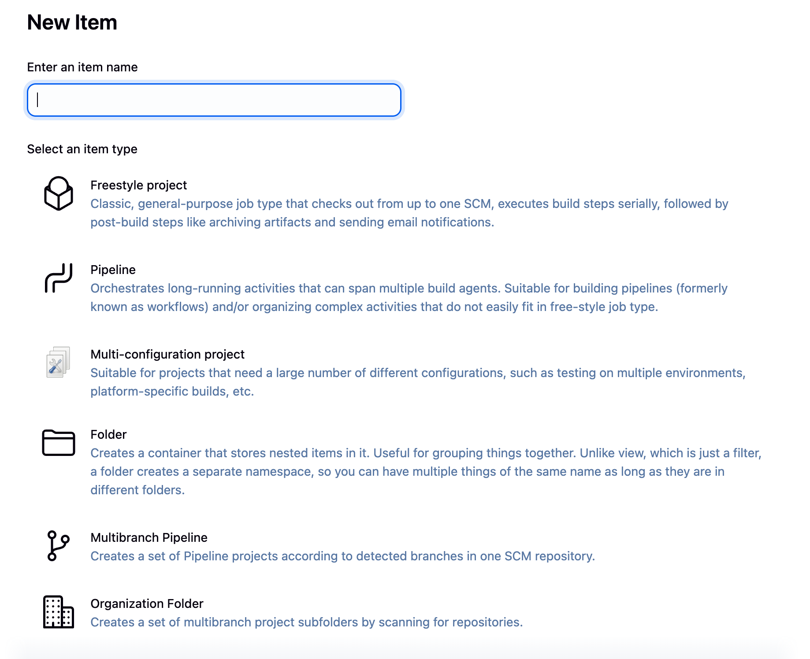

# Jenkins Job Types



Jenkins provides several types of jobs to suit different project needs. Each job type has its own strengths and use cases.

## 1. Freestyle Project

### Overview
The **simplest and most flexible** job type in Jenkins. Perfect for beginners and simple build tasks.

### Key Features
- GUI-based configuration
- Point-and-click setup
- No coding required
- Supports various build steps (shell scripts, batch commands, etc.)

### Use Cases
- Simple build and deploy tasks
- Running scripts or commands
- Basic CI/CD workflows

### Example Configuration
1. Add build steps (Execute shell, Invoke Maven, etc.)
2. Configure post-build actions
3. Set up triggers (SCM polling, webhooks)

## 2. Pipeline

### Overview
**Code-based job configuration** using Jenkinsfile. Infrastructure as Code approach for CI/CD.

### Key Features
- Written in Groovy DSL
- Version controlled (Jenkinsfile)
- Two syntaxes: Declarative and Scripted
- Supports complex workflows
- Pausable and resumable

### Declarative Pipeline Example
```groovy
pipeline {
    agent any
    stages {
        stage('Build') {
            steps {
                echo 'Building...'
                sh 'mvn clean package'
            }
        }
        stage('Test') {
            steps {
                echo 'Testing...'
                sh 'mvn test'
            }
        }
        stage('Deploy') {
            steps {
                echo 'Deploying...'
            }
        }
    }
}
```

### Use Cases
- Complex CI/CD workflows
- Projects requiring version-controlled build configuration
- Multi-stage deployments
- Projects needing approval gates

## 3. Multibranch Pipeline

### Overview
**Automatically creates pipelines** for each branch in your repository.

### Key Features
- Auto-discovers branches
- Creates/deletes jobs as branches are created/deleted
- Each branch gets its own build history
- Requires Jenkinsfile in each branch

### How It Works
1. Scans repository for branches
2. Creates a sub-project for each branch with a Jenkinsfile
3. Builds branches based on triggers
4. Cleans up when branches are deleted

### Use Cases
- Projects with multiple active branches

## 4. Folder

### Overview
**Organizational structure** for grouping related jobs together.

### Key Features
- Groups jobs logically
- Shared configuration across jobs
- Nested folders support
- Access control at folder level
- Environment variables inheritance

### Structure Example
```
📁 Frontend Team
  └── 📄 React App Build
  └── 📄 Vue App Build
  └── 📁 Testing Jobs
      └── 📄 E2E Tests
      └── 📄 Unit Tests
```

### Use Cases
- Organizing jobs by team
- Grouping by project or application
- Separating environments (Dev/Stage/Prod)
- Managing permissions by folder

## 5. Organization Folder

### Overview
**Scans an entire GitHub/Bitbucket/GitLab organization** and creates jobs for all repositories.

### Key Features
- Auto-discovers all repositories
- Creates Multibranch Pipeline for each repo
- Monitors for new repositories
- Configurable scanning criteria
- Supports regex filtering

### How It Works
1. Connects to GitHub/Bitbucket/GitLab organization
2. Scans all repositories
3. Creates Multibranch Pipeline for repos with Jenkinsfile
4. Continuously monitors for new repos

### Use Cases
- Large organizations with many repositories
- Microservices architectures
- Standardized CI/CD across all projects
- Self-service CI/CD for development teams

## Comparison Table

| Feature | Freestyle | Pipeline | Multibranch | Folder | Organization |
|---------|-----------|----------|-------------|---------|--------------|
| Configuration | GUI | Code | Code | N/A | Code |
| Version Control | ❌ | ✅ | ✅ | N/A | ✅ |
| Branch Support | Manual | Manual | Automatic | N/A | Automatic |
| Complexity | Low | Medium | Medium | Low | High |
| Best For | Simple tasks | Complex workflows | Branch-based dev | Organization | Enterprise |

## Choosing the Right Job Type

### Start with Freestyle if:
- You're new to Jenkins
- You have simple build requirements
- You prefer GUI configuration

### Use Pipeline if:
- You want version-controlled builds
- You need complex workflows
- You want reusable build logic

### Use Multibranch Pipeline if:
- You work with feature branches
- You need PR validation
- You want automatic branch discovery

### Use Folders if:
- You need to organize many jobs
- You want shared configuration
- You need access control by groups

### Use Organization Folder if:
- You manage many repositories
- You want automatic job creation
- You need enterprise-scale automation